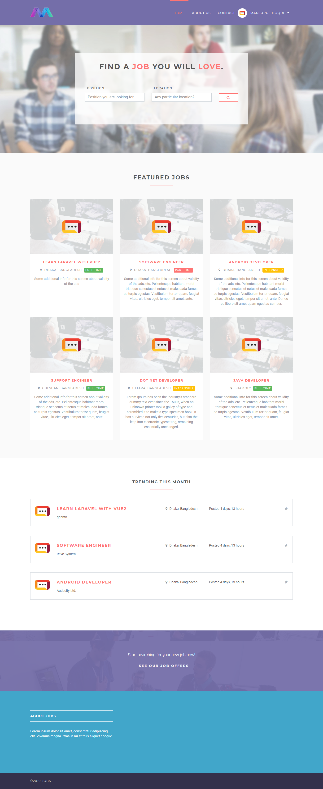
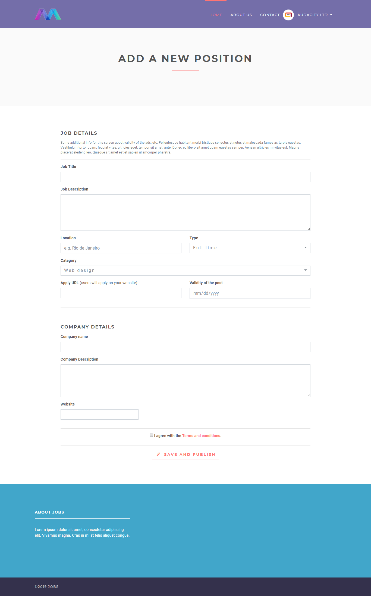
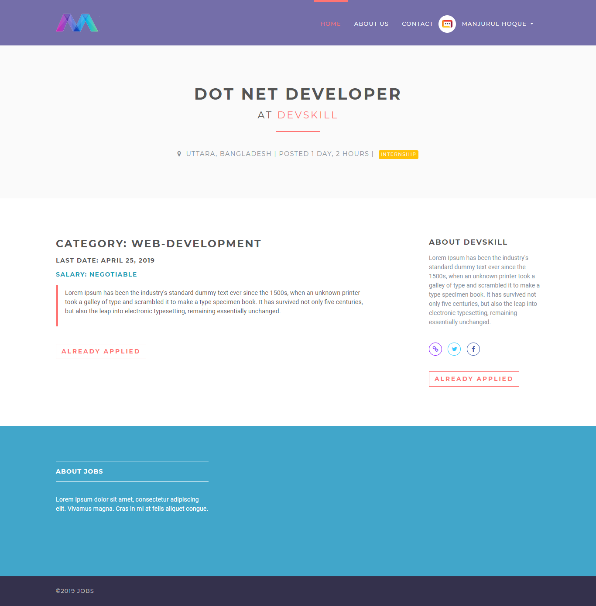

<<<<<<< HEAD
## Django Job Portal

#### An open source online job portal.

Live: [Demo](https://django-portal.herokuapp.com/)

Used Tech Stack

1. Django
2. Sqlite

### Screenshots

## Home page

## Add new position as employer

## Job details

Show your support by 🌟 the project!!
=======
# Online-Job-Management-System
The Online Job Portal is a dynamic web application built using Python and the Django framework. It allows job seekers to search and apply for jobs, while companies can post vacancies and find suitable candidates. An administrator manages users, jobs, and overall portal operations.
>>>>>>> 2567c0e7801149901cb54b1ed3e1812a801d17f2
